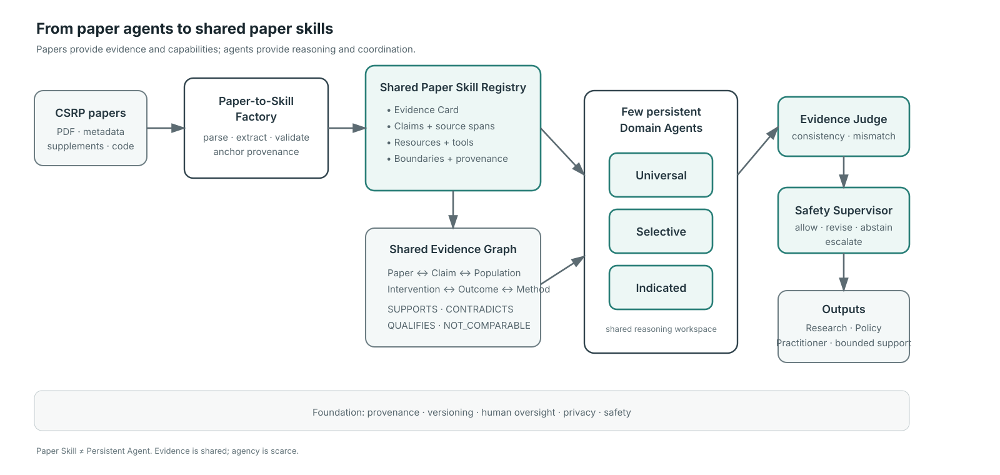

<p align="center">
  
</p>

<p align="center">
  <a href="https://github.com/turboguan/csrp-paper-skills/actions/workflows/ci.yml"></a>
  
  
  
</p>

# CSRP Paper Skills

**A provenance-preserving paper-as-skill architecture for institutional scientific AI and cross-paper evidence synthesis.**

> **Core principle:** papers provide evidence and capabilities; agents provide reasoning and coordination.

This repository is a runnable research prototype for testing a specific scientific-AI architecture question:

**Should each scientific paper become an autonomous agent, or should papers become shared, callable evidence skills used by a small number of persistent reasoning agents?**

The current v0.2 release implements the second design and validates the end-to-end information flow on both synthetic fixtures and five real CSRP-linked publications. It does **not** yet claim that Paper-as-Skill outperforms RAG, monolithic-agent, or one-paper-one-agent baselines.

## Architecture

<p align="center">
  
</p>

The system follows:

```text
Papers
  ↓
Paper-to-Skill Factory
  ↓
Shared Paper Skill Registry + Shared Evidence Graph
  ↓
Few persistent Domain Agents
  ↓
Evidence Judge
  ↓
Safety Supervisor
  ↓
Evidence-grounded answer + claim-level provenance
```

The key distinction is that **Paper Skill ≠ Persistent Agent**. Multiple paper skills can be loaded into one shared reasoning workspace so cross-paper relations can be evaluated without spawning one isolated agent per paper.

## What v0.2 contains

- Pydantic Paper Skill schema and JSON Schema export
- claim-level provenance and source anchors
- in-memory structured Skill Registry
- NetworkX evidence graph
- Universal / Selective / Indicated persistent domain roles
- rule-based Evidence Judge
- safety preflight + Safety Supervisor
- synthetic regression fixtures
- five real CSRP-linked structured Paper Skills
- deterministic end-to-end demos
- benchmark runner interfaces
- unit and integration tests

The current real-paper records are **model-curated research artifacts, not expert-validated gold annotations**.

## Quick start

```bash
git clone https://github.com/turboguan/csrp-paper-skills.git
cd csrp-paper-skills
python3 -m pip install -e '.[dev]'
python3 real_demo.py
pytest -q
```

The real-paper demo writes structured outputs to:

```text
outputs/real/real_demo_output.json
outputs/real/graph_summary.json
```

## Research questions this repository is designed to test

The future matched benchmark will compare:

1. RAG-only
2. single monolithic agent
3. one-paper-one-agent
4. **Paper-as-Skill (ours)**

under increasing evidence load and matched retrieval budgets.

Primary outcomes include:

- cross-paper relation accuracy
- claim-level factuality
- provenance precision / recall
- contradiction vs heterogeneity resolution
- evidence coverage
- calibration / abstention
- safety compliance
- latency / tokens / API calls
- coordination-message burden

## Current scientific status

### Demonstrated in v0.2
- the architecture runs end to end;
- multiple paper skills can coexist in a shared evidence workspace;
- claim-level provenance can be carried through the pipeline;
- individual suicide-risk scoring is blocked before evidence retrieval;
- deterministic tests cover registry, graph, judge, safety, and orchestration logic.

### Not yet demonstrated
- superiority over RAG or multi-agent baselines;
- validated systematic-review quality;
- clinical utility;
- expert-level contradiction adjudication;
- scaling performance on the full institutional corpus.

See [V0.2_STATUS.md](V0.2_STATUS.md) for the exact boundary between implementation status and scientific evidence.

## v0.3 — Evidence-Family Benchmark

The next milestone is a **10–15 paper, 2–3 family benchmark** built around matched scientific questions rather than simply adding more heterogeneous papers.

Candidate families:

- means restriction / charcoal-burning prevention
- media reporting / celebrity-suicide effects
- school/youth gatekeeper or mental-health promotion interventions

For every matched claim pair, experts will adjudicate:

`SUPPORTS` · `CONTRADICTS` · `QUALIFIES` · `NOT_COMPARABLE` · `UNRELATED`

This will create the first gold dataset capable of testing the central architectural hypothesis.

See [docs/V0.3_ROADMAP.md](docs/V0.3_ROADMAP.md).

## Repository guide

| File / directory | Purpose |
|---|---|
| `src/csrp_skills/` | Core implementation |
| `schemas/` | Paper Skill schema |
| `sample_skills/` | Synthetic regression fixtures |
| `real_skills/` | Real-paper structured records |
| `tests/` | Unit and integration tests |
| `architecture.md` | System architecture notes |
| `REAL_PAPER_CATALOG.md` | Real-paper catalog |
| `SOURCE_MANIFEST.md` | Source/provenance manifest |
| `REPRODUCIBILITY.md` | Reproducibility policy |
| `CONTRIBUTING.md` | Contribution guidelines |
| `DISCLAIMER.md` | Research and clinical-use disclaimer |

## Safety boundary

This repository is an **academic research prototype**, not a clinical decision-support system.

It must not be used for:
- autonomous individual suicide-risk scoring;
- diagnosis or triage;
- treatment selection;
- unsupported clinical recommendation.

Individual-facing uses would require substantially stronger validation, governance, privacy protections, and human oversight.

See [DISCLAIMER.md](DISCLAIMER.md) and [SECURITY.md](SECURITY.md).

## Citation

Citation metadata is provided in [CITATION.cff](CITATION.cff). GitHub will expose a **Cite this repository** action after it is merged into the default branch.

Suggested project citation:

> Guan, J. (2026). *CSRP Paper-as-Skill: A provenance-preserving architecture for institutional scientific AI* (v0.2.0). GitHub repository.

A DOI should be added later through an archival release service once the benchmark corpus and first stable research release are frozen.

## Contributing

Contributions are welcome, especially around:

- evidence-family construction;
- claim-level provenance validation;
- graph relation adjudication;
- benchmark runners;
- reproducibility tooling;
- safety and uncertainty evaluation.

Please read [CONTRIBUTING.md](CONTRIBUTING.md) before opening a pull request.

## Project status

**Research prototype — v0.2**

The repository is being developed alongside a scientific manuscript on shared Paper Skills, institutional evidence graphs, and sparse persistent agency.

**Tagline:** *Evidence is shared; agency is scarce.*
