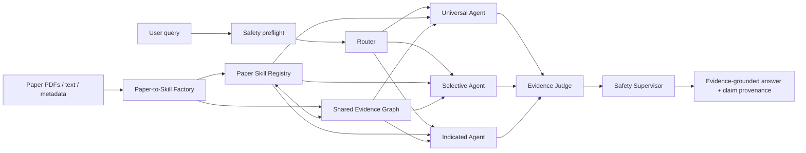

# Architecture — v0.2

## Core principle

**Papers provide evidence and capabilities; agents provide reasoning and coordination.**

A paper is a shared skill/evidence object, not a persistent autonomous agent.

## Shared evidence workspace

For a query requiring five papers, **one domain agent receives relevant claims from multiple Paper Skills in one workspace**. The system does not spawn five independent paper agents. v0.2 adds lightweight query-aware claim selection, but all selected evidence remains visible in the same reasoning workspace.

## Evidence graph schema

Node types:
- `Paper`
- `Claim`
- `Population`
- `Intervention`
- `Outcome`
- `Method`

Claim/entity edges:
- `HAS_CLAIM`
- `STUDIES_POPULATION`
- `TESTS_INTERVENTION`
- `MEASURES_OUTCOME`
- `USES_METHOD`

Claim-to-claim evidence edges:
- `SUPPORTS`
- `CONTRADICTS`
- `QUALIFIES`

Paper-to-paper curated edge:
- `RELATED_TO`

`SUPPORTS / CONTRADICTS / QUALIFIES` are relations among claims, not papers, because one paper can contain multiple claims with different relationships. v0.2 deliberately avoids inventing these edges when the five real papers do not provide like-for-like evidence pairs.

## Safety boundary

Individual suicide-risk scoring and individualized clinical-action requests are blocked at query preflight before evidence retrieval. The post-reasoning Safety Supervisor remains in place to detect provenance or causal-language problems in otherwise in-scope synthesis.
